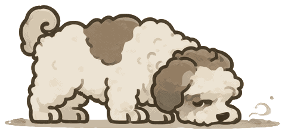

<p align="center">
  
</p>

# SniffOut

A local, multi-wiki research workbench: browse wiki articles and sources in a
Flask web UI, search the web, ingest URLs/PDFs/markdown into a wiki, and let
researcher agents write the wiki for you under a judge-supervised loop.


Rebuild it after UI changes with `python utils/make_gif.py` — see
[utils/make_gif.md](utils/make_gif.md) for what's shown.

## What it does

- **Multi-wiki UI** — wiki picker, article/source browsing, per-wiki search,
  plan and leads pages, archive/unarchive
- **Web search** — Exa MCP endpoint (`web_search_exa`), hits appended to the
  wiki's `leads.md`
- **Ingest** — URLs (headless Chrome), PDFs (local or remote), and local
  `.md` files cleaned into a wiki's `sources/` as markdown
- **Researcher loop** — `Start Loop` re-dispatches research runs until a
  separate judge pass (a cheap model reading `plan.md`/`log.md` only) verdicts
  `done`, the operator stops, or a run cap is hit
- **Export** — build a Docusaurus site from a wiki (`utils/export_docusaurus.py`)

Agent jobs run in-process on
[uharness](https://github.com/Origamify/uharness) — a minimal prompt →
tool-calling loop → result library. Endpoint config lives in a gitignored
`.env` in the repo root (`URL`, `KEY`, `MODEL`, `FAST_MODEL`) — template:
`.env.example`.

## Requirements

- **Python** ≥ 3.10
- **An OpenAI-compatible chat-completions endpoint** — any provider or a
  local server, configured via `.env` (below)
- **Chrome** — headless, for URL ingest only (PDFs and `.md` files don't need
  it)
- **Firefox** — only for the optional E2E review
  (`tests/utils/selenium_review.py`)

## Setup

```bash
# 1. Clone and install (uharness comes from GitHub via requirements.txt):
git clone https://github.com/Origamify/SniffOut.git
cd SniffOut
python -m venv .venv && source .venv/bin/activate
pip install -r requirements.txt

# 2. Configure the endpoint (gitignored): URL/KEY of any OpenAI-compatible
#    chat-completions endpoint, MODEL for research, FAST_MODEL for
#    cleanup + judging:
cp .env.example .env && chmod 600 .env

# 3. Run:
./launch.sh                        # Flask dev server on http://localhost:3040
./launch.sh --jobs 4               # 4 agent jobs in parallel (default 2; extras queue)
./test.sh                          # offline test suite (LLM calls stubbed)
```

Then open **http://localhost:3040** and create your first wiki. A missing
`URL` in `.env` fails fast with `RuntimeError: <repo>/.env is missing URL`.

## Starting a wiki

Two steps:

1. **Create it** — on the picker page, type `Roman empire history` and hit
   **Create**. SniffOut makes `research_repository/Roman empire history/`
   with empty `sources/`, `articles/`, `plan.md`, `leads.md`, `log.md`.
2. **Give it a direction and go** — one chat message sets the goal, e.g.:

   > Build a wiki on the Roman eras — Kingdom, Republic, Empire: for each,
   > timeline, government, daily life, and decline.

   The researcher searches, ingests sources, writes articles, and rewrites
   `plan.md` for the next run. Chat steers each run; **Start Loop** lets the
   judge re-run until the plan is covered.

More on runs and loops: `workflow.md`.

## Utilities

Standalone scripts against wikis in `research_repository/` (run from the repo
root with the venv active):

- **Link review** — `python utils/link_review.py <wiki>...` — walk a wiki's
  articles, enforce link brackets (internal `[text](path.md)`, external
  `[[label]](url)`), flag dead links as `<deadlink>url</deadlink>`, and mark
  uncited sources as pruning candidates. `--dry-run` previews without
  writing.
- **Docusaurus export** — `python utils/export_docusaurus.py <wiki>` — build
  a static Docusaurus site under `docusaurus_export/<wiki-slug>/` from a
  wiki's articles (`--sources` to include them; `.order` files drive the
  sidebar). Scaffolds everything needed to `npm start`.

## Docs

- `workflow.md` — user-facing overview: what you do, how a run advances a wiki
- `about.md` — short "what is this" page
- `project.md` — maintainer's map: architecture, file map, conventions, settings

## Notes

- **Dev server**: Flask's built-in server on localhost only — not for
  production deployment or shared hosting.
- `src/static/js/mermaid.min.js` is a vendored copy of
  [mermaid](https://github.com/mermaid-js/mermaid) (MIT), ~3.5 MB, kept for
  fully offline rendering; diagrams render client-side with
  `securityLevel: strict`.
- All outbound fetches go through an SSRF guard (`src/fetch_guard.py`);
  source markdown is bleach-sanitized before render.

## License

[MIT](LICENSE)
